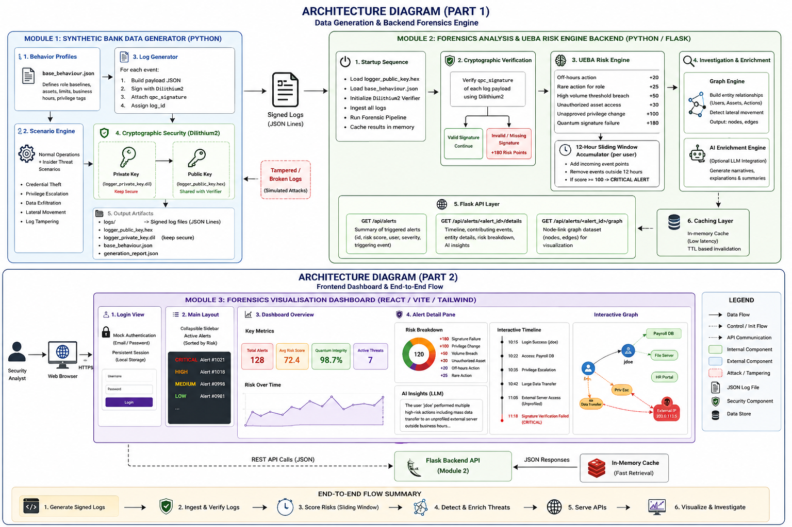

# QuantumForensics - Finspark



QuantumForensics is a quantum-safe forensic investigation tool and pipeline. It generates synthetic banking logs, runs a risk and enrichment engine over them, and serves an intuitive frontend for visualisation and analysis.

## How to Download and Use

### Prerequisites
- Python 3.8+
- Node.js (v14+ recommended)

### 1. Download the Project
Download or clone the repository to your local machine.
```bash
git clone <repository_url>
cd "QuantumForensics - Finspark"
```

### 2. Setup and Run the Backend
The backend runs the forensic investigation pipeline and serves the API for the frontend.

```bash
cd Backend
# (Optional) Create and activate a virtual environment
python -m venv .venv
# On Windows: .venv\Scripts\activate
# On Mac/Linux: source .venv/bin/activate

# Install required dependencies
pip install flask flask_cors dilithium-py

# Set the Groq API key for AI-assisted risk enrichment
# On Windows: set GROQ_API_KEY="gsk_..."
# On Mac/Linux: export GROQ_API_KEY="gsk_..."

# Run the server
python server.py
```
*Note: The server will analyze the logs upon booting and then start the API.*

### 3. Setup and Run the Frontend
The frontend is a React + Vite application.

```bash
cd Frontend
# Install dependencies
npm install

# Start the development server
npm run dev
```
Open the local URL provided by Vite (e.g., `http://localhost:5173`) in your web browser.

---

## Modifying User Behaviour and Anomalies

The project uses synthetic data to simulate user activity and malicious events. You can fully customize these scenarios.

1. **Navigate to the Data Generator:**
   ```bash
   cd "Data Generator"
   ```

2. **Edit the Configuration Files:**
   - **`base_behaviour.json`**: Define regular user profiles, roles, normal working hours, data usage limits, and which assets they can access.
   - **`scenario_data.json`**: Inject specific malicious anomalies. You can add explicit events such as high-volume data exfiltration, privilege escalation, or off-hours access.
   - **`assets.json`**: Modify or add the target assets (databases, servers, CRM) in the environment.

3. **Generate the Dataset:**
   Run the Python script to create a new batch of synthetic logs incorporating your modified behaviours.
   ```bash
   # You might need dilithium-py installed here as well
   python BehaviourGenerator.py
   ```
   This will output a new `synthetic_banking_logs.json` and `logger_public_key.hex` file.

4. **Analyze the New Data:**
   Copy the updated `synthetic_banking_logs.json` file into the `Backend` directory (if it's not already linked) and restart the `server.py` backend. The new anomalies and behaviours will now be flagged and reported by the forensic engine. Ensure to keep `base_behavior.json` in backend and data generator the same.
